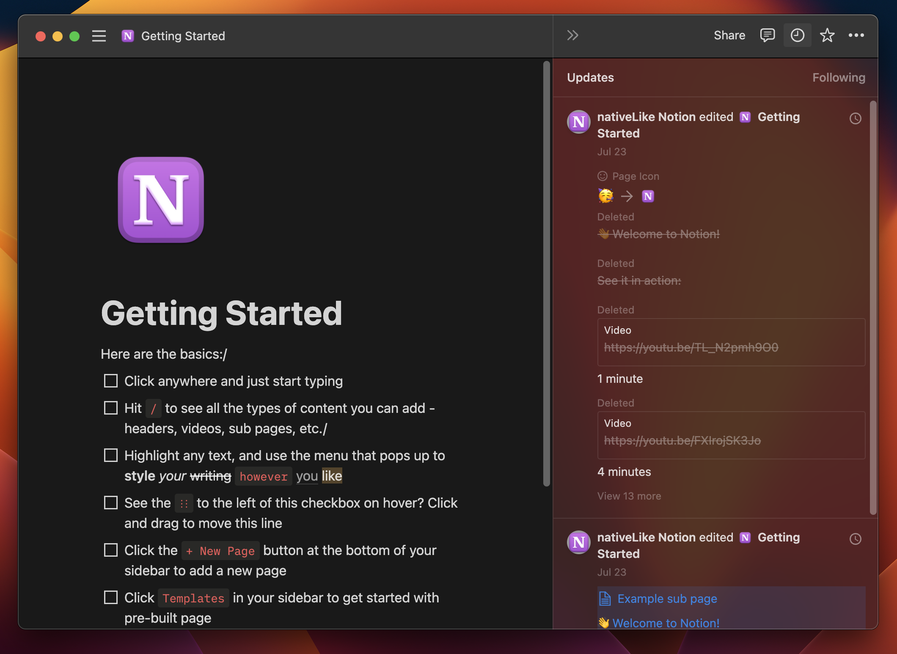

# nativeLike Notion

A repackaged [Notion](https://www.notion.so/) app that runs on macOS.

This is built with [Nativefier](https://github.com/nativefier/nativefier), a project based on [Electron](https://www.electronjs.org).

- A vibrant sidebar and look-like-being-vibrant menus and windows; (Older versions has full vibrancy, but it was not efficient enough.)
- Fixed font fallback;
- Sandbox support;
- Native-like scroll bar;
- Native-like everything;
- Other minor changes;

I am currently working on using SwiftUI and WebKit to build it so that it will consume less battery life. However, this may take a long time.
